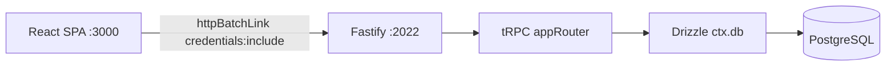
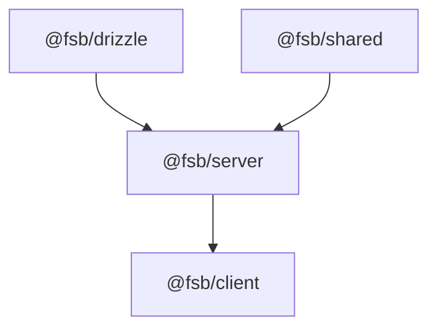

# Developer Guide — Extending the Fullstack SaaS Boilerplate

This document is the companion to [README.md](README.md). The README covers installation, demo, and features. **This guide explains how to extend the template** — adding database tables, tRPC endpoints, React pages, and customizing each technology in the stack.

Use `Ctrl+F` / `Cmd+F` to search this page, or jump via the table of contents below.

---

## Table of Contents

1. [Quick Reference](#1-quick-reference)
2. [Architecture Overview](#2-architecture-overview)
3. [Monorepo & pnpm Workspaces](#3-monorepo--pnpm-workspaces)
4. [End-to-End Recipe: Add a New Feature](#4-end-to-end-recipe-add-a-new-feature)
5. [Database — Drizzle ORM](#5-database--drizzle-orm)
6. [API Layer — tRPC](#6-api-layer--trpc)
7. [Validation — Zod & @fsb/shared](#7-validation--zod--fsbshared)
8. [Frontend — Pages, Routing & Components](#8-frontend--pages-routing--components)
9. [Styling — Tailwind CSS v4](#9-styling--tailwind-css-v4)
10. [Authentication — Better Auth](#10-authentication--better-auth)
11. [Real-Time — tRPC Subscriptions (SSE)](#11-real-time--trpc-subscriptions-sse)
12. [External APIs](#12-external-apis)
13. [State, Caching & TanStack Query](#13-state-caching--tanstack-query)
14. [E2E Testing — Playwright](#14-e2e-testing--playwright)
15. [Build, Deploy & Environment Variables](#15-build-deploy--environment-variables)
16. [Conventions & Code Style](#16-conventions--code-style)
17. [Troubleshooting & FAQ](#17-troubleshooting--faq)
18. [Appendix: Existing Routers & Pages Index](#18-appendix-existing-routers--pages-index)

---

## 1. Quick Reference

### Common Tasks Cheat Sheet

| Task | Where | Command |
|------|-------|---------|
| Add a database table | `packages/drizzle/src/db/schema.ts` | `pnpm push` |
| Seed the database | `packages/drizzle/src/seed/` | `pnpm seed` |
| Add a tRPC router | `server/src/router/` + register in `index.ts` | — |
| Add a React page | `client/src/pages/` or `client/src/components/<domain>/` | — |
| Register a route | `client/src/AppRouter.tsx` | — |
| Add a sidebar nav link | `client/src/layout/NavLinks.tsx` | — |
| Run dev (client + server) | root | `pnpm dev` |
| Run server only | root | `pnpm dev:server` |
| Run client only | root | `pnpm dev:client` |
| Build for production | root | `pnpm build` |
| Run production | root | `pnpm start` |
| Run E2E tests | root | `pnpm test` |
| Build order | root | drizzle → shared → server → client |

### Default Ports

| Service | Port | Env variable |
|---------|------|--------------|
| React SPA (Vite) | 3000 | — |
| Fastify server | 2022 | `PORT` |
| PostgreSQL | 5432 | `DATABASE_URL` |

### Request Flow



### Adding a New Endpoint — Checklist

1. Define Zod input schema (inline or in `@fsb/shared`)
2. Create procedure in a router file under `server/src/router/`
3. Register router in `server/src/router/index.ts`
4. Call from client via `useTRPC()` + `useQuery` / `useMutation`
5. (Optional) Add a page, route, and nav link

### Adding a New Page — Checklist

1. Create component in `client/src/pages/` or `client/src/components/<domain>/`
2. Add `<Route>` in `client/src/AppRouter.tsx`
3. Wrap with `<PrivateRoute>` if auth is required
4. Add `<NavLink>` in `client/src/layout/NavLinks.tsx` if needed
5. Wire up tRPC queries/mutations inside the component

---

## 2. Architecture Overview

### Monorepo Packages

This project is a **pnpm workspace** with six packages:

| Package name | Directory | Role |
|--------------|-----------|------|
| `fullstack-saas-boilerplate` | `/` (root) | Orchestration scripts |
| `@fsb/client` | `client/` | React 19 + Vite + Tailwind SPA |
| `@fsb/server` | `server/` | Fastify + tRPC + Better Auth API |
| `@fsb/drizzle` | `packages/drizzle/` | Drizzle schema, push, seed |
| `@fsb/shared` | `packages/zod/` | Shared Zod validation schemas |
| `@fsb/tests-e2e` | `tests-e2e/` | Playwright smoke tests |

> **Naming note:** The shared schemas package is named `@fsb/shared` but lives in the `packages/zod/` folder. Root scripts refer to it as `build:zod`.

### Why SPA + Separate API?

Unlike T3 (Next.js), this stack keeps the frontend as a **static SPA** deployable to object storage (e.g. AWS S3). The backend is a standalone Fastify server. This is ideal for **web apps** (dashboards, SaaS products) but **not SEO-friendly** — there is no server-side rendering.

### End-to-End Type Safety

The client imports the server's router type directly — no published types package:

```typescript
// client/src/lib/trpc.ts
import type { AppRouter } from "../../../server/src/router"
```

This gives full autocomplete and type checking for every tRPC procedure call. When you add a procedure on the server, the client sees it immediately (after TypeScript re-checks).

### Build Dependency Graph

Shared packages must compile before the server; the server must exist before the client builds (for type imports):



### Directory Layout

```
/
├── client/                  # @fsb/client — React SPA
│   └── src/
│       ├── pages/           # Route-level screens
│       ├── components/      # Feature modules (auth, user, message, …)
│       ├── layout/          # App shell (sidebar, header, pagination)
│       ├── template/        # Loading, Error, shared UI states
│       ├── lib/             # trpc, auth-client, utils
│       └── store/           # Zustand (theme only)
├── server/                  # @fsb/server — Fastify API
│   └── src/
│       ├── router/          # tRPC routers (one file per domain)
│       ├── handlers/        # Non-tRPC handlers (auth)
│       ├── lib/             # Auth config, utilities
│       ├── api/             # External HTTP API clients
│       └── ai/              # OpenAI streaming
├── packages/
│   ├── drizzle/             # @fsb/drizzle — DB schema & seed
│   └── zod/                 # @fsb/shared — shared Zod schemas
└── tests-e2e/               # Playwright tests
```

---

## 3. Monorepo & pnpm Workspaces

### Workspace Configuration

File: [`pnpm-workspace.yaml`](pnpm-workspace.yaml)

```yaml
packages:
  - "client"
  - "server"
  - "tests-e2e"
  - "packages/*"
```

All four globs are workspace members. There is no separate `apps/` folder.

### Running Commands in a Single Package

Use `pnpm --filter <package-name> run <script>`:

```bash
pnpm --filter @fsb/server run dev
pnpm --filter @fsb/client run build
pnpm --filter @fsb/drizzle run push
```

The root `package.json` wraps these for convenience:

| Root script | What it runs |
|-------------|--------------|
| `pnpm dev` | Client + server in parallel |
| `pnpm dev:client` | Vite dev server on :3000 |
| `pnpm dev:server` | tsx watch on :2022 |
| `pnpm build` | drizzle → shared → server → client |
| `pnpm push` | Drizzle schema push to Postgres |
| `pnpm seed` | Seed script |
| `pnpm test` | Playwright E2E |
| `pnpm start` | Production client + server |
| `pnpm clean` | Remove node_modules, dist, lockfiles |

### Adding a New Shared Package

1. Create a folder under `packages/my-package/`
2. Add a `package.json` with `"name": "@fsb/my-package"`
3. It is automatically included via the `packages/*` glob
4. In any consumer's `package.json`, add:
   ```json
   "@fsb/my-package": "workspace:*"
   ```
5. Add a build script to root `package.json` if it needs compilation before the server

### Environment Files

| File | Used by | Key variables |
|------|---------|---------------|
| `.env` (root) | Server, Drizzle | `DATABASE_URL`, `BETTER_AUTH_SECRET`, `OPENAI_API_KEY`, `CLIENT_URL` |
| `client/.env` | Vite client | `VITE_URL_BACKEND` |

Copy from `example.env` and `client/example.env` respectively. Only variables prefixed with `VITE_` are exposed to the browser.

---

## 4. End-to-End Recipe: Add a New Feature

This section walks through adding a complete **Projects** feature — from database table to sidebar link. Use it as a template for any new feature.

### Existing Simpler Example: Games

Before the full walkthrough, note the **Games** feature as a lighter pattern (no database):

- Server: [`server/src/router/gameRouter.ts`](server/src/router/gameRouter.ts) — calls external API
- Client: [`client/src/pages/GamesPage.tsx`](client/src/pages/GamesPage.tsx) — `useQuery(trpc.game.getGames.queryOptions(...))`

---

### Step 1 — Define the Database Schema

File: [`packages/drizzle/src/db/schema.ts`](packages/drizzle/src/db/schema.ts)

Add a new table and its relations:

```typescript
export const projectTable = pgTable("project", {
  id: uuid().defaultRandom().primaryKey(),
  name: text("name").notNull(),
  description: text("description"),
  ownerId: uuid("owner_id")
    .notNull()
    .references(() => userTable.id),
  createdAt: timestamp("created_at").defaultNow().notNull(),
})

export const projectToUserRelations = relations(projectTable, ({ one }) => ({
  owner: one(userTable, {
    fields: [projectTable.ownerId],
    references: [userTable.id],
  }),
}))
```

**Critical:** Add the new table and relations to the exported `schema` object at the bottom of the file. Without this, the relational query API (`db.query.projectTable.findMany`) will not work:

```typescript
export const schema = {
  userTable,
  sessionTable,
  sessionToUserRelations,
  accountTable,
  verificationTable,
  exampleTable,
  messageTable,
  messageToUserRelations,
  projectTable,           // add
  projectToUserRelations, // add
}
```

Push the schema to Postgres:

```bash
pnpm push
```

Optionally add seed data in [`packages/drizzle/src/seed/seed.ts`](packages/drizzle/src/seed/seed.ts) and run `pnpm seed`.

---

### Step 2 — Create the tRPC Router

Create `server/src/router/projectRouter.ts`:

```typescript
import { adminProcedure, protectedProcedure, publicProcedure, router } from "../trpc.js"
import { z } from "zod"
import { TRPCError } from "@trpc/server"
import { projectTable, drizzleOrm } from "@fsb/drizzle"

const { eq, desc } = drizzleOrm

const projectRouter = router({
  listProjects: publicProcedure.query(async ({ ctx }) => {
    return ctx.db.query.projectTable.findMany({
      orderBy: [desc(projectTable.createdAt)],
      with: {
        owner: { columns: { id: true, name: true, image: true } },
      },
    })
  }),

  createProject: protectedProcedure
    .input(
      z.object({
        name: z.string().min(1, "Name is required").max(100),
        description: z.string().max(500).optional(),
      }),
    )
    .mutation(async ({ ctx, input }) => {
      const [project] = await ctx.db
        .insert(projectTable)
        .values({
          name: input.name,
          description: input.description,
          ownerId: ctx.user.id,
        })
        .returning()
      return project
    }),

  deleteProject: adminProcedure
    .input(z.object({ id: z.string().uuid() }))
    .mutation(async ({ ctx, input }) => {
      await ctx.db.delete(projectTable).where(eq(projectTable.id, input.id))
      return { success: true }
    }),
})

export default projectRouter
```

Register it in [`server/src/router/index.ts`](server/src/router/index.ts):

```typescript
import projectRouter from "./projectRouter.js"

export const appRouter = router({
  session: sessionRouter,
  health: healthRouter,
  game: gameRouter,
  user: userRouter,
  message: messageRouter,
  project: projectRouter, // add
})
```

Client calls will be namespaced: `trpc.project.listProjects`, `trpc.project.createProject`, `trpc.project.deleteProject`.

---

### Step 3 — Create the Client Page

Create `client/src/pages/ProjectsPage.tsx`:

```tsx
import { useQuery, useMutation, useQueryClient } from "@tanstack/react-query"
import { useTRPC } from "../lib/trpc"
import { LoadingTemplate } from "../template/LoadingTemplate"
import ErrorTemplate from "../template/ErrorTemplate"
import { FolderIcon } from "@phosphor-icons/react"
import { useState } from "react"

const ProjectsPage = () => {
  const trpc = useTRPC()
  const queryClient = useQueryClient()
  const [name, setName] = useState("")

  const projectsQuery = useQuery(trpc.project.listProjects.queryOptions())

  const createMutation = useMutation(
    trpc.project.createProject.mutationOptions({
      onSuccess: () => {
        queryClient.invalidateQueries({ queryKey: trpc.project.listProjects.queryKey() })
        setName("")
      },
    }),
  )

  if (projectsQuery.isLoading) return <LoadingTemplate />
  if (projectsQuery.isError) return <ErrorTemplate message={projectsQuery.error.message} />

  return (
    <div className="p-6">
      <div className="flex items-center">
        <FolderIcon className="text-3xl mr-3" />
        <h1>Projects</h1>
      </div>
      <p>Manage your projects.</p>

      <form
        className="mt-4 flex gap-2"
        onSubmit={(e) => {
          e.preventDefault()
          createMutation.mutate({ name })
        }}
      >
        <input
          type="text"
          value={name}
          onChange={(e) => setName(e.target.value)}
          placeholder="Project name"
          className="input-default"
        />
        <button type="submit" className="btn-blue" disabled={createMutation.isPending}>
          Create
        </button>
      </form>

      <div className="mt-6 overflow-x-auto">
        <table>
          <thead>
            <tr>
              <th>Name</th>
              <th>Owner</th>
              <th>Created</th>
            </tr>
          </thead>
          <tbody>
            {projectsQuery.data?.map((project) => (
              <tr key={project.id}>
                <td>{project.name}</td>
                <td>{project.owner?.name}</td>
                <td>{new Date(project.createdAt).toLocaleDateString()}</td>
              </tr>
            ))}
          </tbody>
        </table>
      </div>
    </div>
  )
}

export default ProjectsPage
```

---

### Step 4 — Register the Route and Nav Link

**Route** — add to [`client/src/AppRouter.tsx`](client/src/AppRouter.tsx):

```tsx
import ProjectsPage from "./pages/ProjectsPage"

// Inside <Routes>:
<Route path="/projects" element={<PrivateRoute element={<ProjectsPage />} />} />
```

Use `<PrivateRoute>` when the page requires login. Omit it for public pages.

**Nav link** — add to [`client/src/layout/NavLinks.tsx`](client/src/layout/NavLinks.tsx):

```tsx
import { FolderIcon } from "@phosphor-icons/react"

// Inside the nav, optionally gated by session:
{session.data?.user && (
  <NavLink
    onClick={props.onClick}
    to="/projects"
    className={({ isActive }) =>
      `block py-2.5 px-4 rounded-sm transition ${
        isActive ? "bg-gray-200 dark:bg-gray-700" : "hover:bg-gray-100 dark:hover:bg-gray-900"
      }`
    }
  >
    <div className="flex items-center">
      <FolderIcon className="mr-2" weight="fill" />
      Projects
    </div>
  </NavLink>
)}
```

---

### Step 5 — Verify

```bash
pnpm dev
```

1. Open http://localhost:3000/projects
2. Log in if using `PrivateRoute`
3. Create a project and confirm it appears in the table
4. Check the server logs for errors

**Optional E2E test** — add to [`tests-e2e/tests/smoke.test.ts`](tests-e2e/tests/smoke.test.ts):

```typescript
test("go to /projects", async ({ page }) => {
  await page.goto("/projects")
  await page.waitForSelector("text=Projects")
})
```

Run with the app already running: `pnpm test`

---

## 5. Database — Drizzle ORM

### Package Location

All database code lives in [`packages/drizzle/`](packages/drizzle/):

| File | Purpose |
|------|---------|
| `src/db/schema.ts` | Table definitions, relations, `schema` export |
| `drizzle.config.ts` | drizzle-kit configuration |
| `src/seed/seed.ts` | Seed entry point |
| `src/seed/initUsersData.ts` | Fixture data |
| `index.ts` | Re-exports schema + ORM namespaces |

### Schema Patterns

#### Define a Table

```typescript
import { pgTable, text, uuid, timestamp } from "drizzle-orm/pg-core"

export const myTable = pgTable("my_table", {
  id: uuid().defaultRandom().primaryKey(),
  name: text("name").notNull(),
  createdAt: timestamp("created_at").defaultNow().notNull(),
})
```

#### Enums

```typescript
export const rolesEnum = pgEnum("roles", ["user", "admin"])

// Use in a column:
role: rolesEnum().default("user"),
```

#### Foreign Keys

```typescript
ownerId: uuid("owner_id")
  .notNull()
  .references(() => userTable.id),
```

#### Indexes

```typescript
export const userTable = pgTable(
  "user",
  { /* columns */ },
  (table) => [t.uniqueIndex("email_idx").on(table.email)],
)
```

#### Relations (for `db.query.*` joins)

```typescript
import { relations } from "drizzle-orm"

export const messageToUserRelations = relations(messageTable, ({ one }) => ({
  sender: one(userTable, {
    fields: [messageTable.senderId],
    references: [userTable.id],
  }),
}))
```

#### The `schema` Export

Every table and relation used with the relational query API must be in the `schema` object:

```typescript
export const schema = {
  userTable,
  messageTable,
  messageToUserRelations,
  // ... all tables and relations
}
```

### Database Client Initialization

File: [`server/src/context.ts`](server/src/context.ts)

```typescript
import { drizzleOrm_NodePostgres, userTable, schema } from "@fsb/drizzle"
const { drizzle } = drizzleOrm_NodePostgres

export const db = drizzle(databaseUrl, { schema })
```

- A **singleton** `db` instance is created at module load
- Passed to every tRPC request via `ctx.db`
- Also used by Better Auth's Drizzle adapter

### Better Auth Tables

These tables are mapped in [`server/src/lib/auth.ts`](server/src/lib/auth.ts). **Do not rename** without updating the adapter:

| Drizzle export | Better Auth mapping |
|----------------|---------------------|
| `userTable` | `user` |
| `sessionTable` | `session` |
| `accountTable` | `account` |
| `verificationTable` | `verification` |

The `userTable` includes a `role` column (`rolesEnum`) used by `adminProcedure`.

### Query Patterns

Import operators from the workspace package:

```typescript
import { userTable, messageTable, drizzleOrm } from "@fsb/drizzle"
const { eq, and, or, ilike, desc, lt, count, asc } = drizzleOrm
```

#### Relational Query API (`db.query.*`)

Best for reads with joins:

```typescript
// From messageRouter.ts
const messages = await ctx.db.query.messageTable.findMany({
  where: input.before ? lt(messageTable.createdAt, new Date(input.before)) : undefined,
  orderBy: [desc(messageTable.createdAt)],
  limit: 20,
  with: {
    sender: {
      columns: { id: true, name: true, image: true },
    },
  },
})
```

Other relational methods: `findFirst`, column selection via `columns: { ... }`, pagination via `limit`/`offset`.

#### SQL Builder — INSERT

```typescript
await ctx.db.insert(messageTable).values({
  message: input.message,
  senderId: ctx.user.id,
})
```

#### SQL Builder — UPDATE with RETURNING

```typescript
const user = await db
  .update(userTable)
  .set({ name: input.name, age: input.age })
  .where(eq(userTable.id, input.id))
  .returning()
```

#### SQL Builder — DELETE

```typescript
await db.delete(sessionTable).where(eq(sessionTable.id, input.sessionId))
```

#### SQL Builder — SELECT with Aggregate

```typescript
const totalData = await db.select({ count: count() }).from(sessionTable)
const total = totalData[0].count
```

#### Filter Helpers

| Operator | Use case |
|----------|----------|
| `eq(col, val)` | Exact match |
| `and(...conditions)` | Combine with AND |
| `or(...conditions)` | Combine with OR |
| `ilike(col, '%term%')` | Case-insensitive search |
| `lt(col, val)` | Less than (cursor pagination) |
| `desc(col)` / `asc(col)` | Ordering |

### Schema Sync — `pnpm push`

This project uses **drizzle-kit push** (schema sync), not versioned SQL migrations:

```bash
pnpm push   # → drizzle-kit push
```

- Compares `schema.ts` against the live database and applies changes
- Great for development; no migration history is kept
- For production with audit requirements, consider switching to `drizzle-kit generate` + `drizzle-kit migrate`

Config: [`packages/drizzle/drizzle.config.ts`](packages/drizzle/drizzle.config.ts)

```typescript
export default defineConfig({
  out: "./drizzle",
  schema: "./src/db/schema.ts",
  dialect: "postgresql",
  dbCredentials: { url: databaseUrl },
})
```

### Seeding

```bash
pnpm seed   # → tsx src/seed/seed.ts
```

Add fixture data in [`packages/drizzle/src/seed/initUsersData.ts`](packages/drizzle/src/seed/initUsersData.ts) and call it from [`packages/drizzle/src/seed/seed.ts`](packages/drizzle/src/seed/seed.ts).

---

## 6. API Layer — tRPC

### Core Files

| File | Purpose |
|------|---------|
| [`server/src/trpc.ts`](server/src/trpc.ts) | tRPC init, procedure types |
| [`server/src/context.ts`](server/src/context.ts) | Request context (user, db, session) |
| [`server/src/router/index.ts`](server/src/router/index.ts) | Root `appRouter` composition |
| [`server/src/router/*.ts`](server/src/router/) | Domain routers |
| [`server/src/index.ts`](server/src/index.ts) | Fastify mount |
| [`client/src/lib/trpc.ts`](client/src/lib/trpc.ts) | Client hooks factory |
| [`client/src/App.tsx`](client/src/App.tsx) | tRPC + QueryClient providers |

### Procedure Types

Defined in [`server/src/trpc.ts`](server/src/trpc.ts):

| Procedure | Auth required | Use when |
|-----------|---------------|----------|
| `publicProcedure` | No | Health checks, public data, subscriptions |
| `protectedProcedure` | Yes (`ctx.user`) | User-specific reads/writes |
| `adminProcedure` | Yes + `role === "admin"` | Admin-only operations |

```typescript
export const protectedProcedure = t.procedure.use(async function isAuthed(opts) {
  if (!opts.ctx.user) {
    throw new TRPCError({ code: "UNAUTHORIZED" })
  }
  return opts.next({ ctx: { ...opts.ctx, user: opts.ctx.user } })
})
```

There is no global tRPC middleware — auth is enforced per procedure type.

### Context Shape

Every tRPC handler receives `ctx`:

| Field | Always present | Description |
|-------|----------------|-------------|
| `req`, `res` | Yes | Fastify request/response |
| `db` | Yes | Drizzle client singleton |
| `config` | Yes | `{ databaseUrl }` |
| `user` | When authenticated | Full Drizzle user row |
| `session` | When authenticated | Better Auth session (includes `impersonatedBy`) |

### Router Composition

One file per domain, nested under keys in `appRouter`:

```typescript
// server/src/router/index.ts
export const appRouter = router({
  session: sessionRouter,
  health: healthRouter,
  game: gameRouter,
  user: userRouter,
  message: messageRouter,
})

export type AppRouter = typeof appRouter
```

Client namespace: `trpc.<key>.<procedureName>`

Example: `trpc.user.getUsers`, `trpc.message.sendMessage`, `trpc.health.trpc`

### Procedure Kinds

#### Query (read)

```typescript
getGames: publicProcedure
  .input(z.object({ size: z.number() }))
  .query(async ({ input }) => {
    return fanapis.getGames(input.size)
  }),
```

#### Mutation (write)

```typescript
updateUser: protectedProcedure
  .input(z.object({ id: z.string(), name: z.string().optional() }))
  .mutation(async (opts) => {
    if (opts.ctx.user.id !== opts.input.id) {
      throw new TRPCError({ code: "FORBIDDEN", message: "Cannot update other users" })
    }
    return opts.ctx.db.update(userTable).set({ name: opts.input.name }).where(...)
  }),
```

#### Subscription (real-time)

```typescript
sseMessages: publicProcedure.subscription(async function* () {
  while (true) {
    const payload = await new Promise((resolve) => ee.once("fsb-chat", resolve))
    yield payload
  }
}),
```

See [Section 11](#11-real-time--trpc-subscriptions-sse) for subscription details.

### Input Validation

Use Zod with `.input()`:

```typescript
.input(
  z.object({
    page: z.number(),
    search: z.string().optional(),
  }),
)
```

tRPC validates automatically and returns structured errors to the client.

### Error Handling

Use `TRPCError` for auth and business rules:

```typescript
import { TRPCError } from "@trpc/server"

throw new TRPCError({ code: "UNAUTHORIZED" })          // 401
throw new TRPCError({ code: "FORBIDDEN", message: "..." })  // 403
throw new TRPCError({ code: "NOT_FOUND", message: "..." })  // 404
```

Plain `throw new Error("...")` works for unexpected cases but returns a generic error to the client.

### Server Mount

File: [`server/src/index.ts`](server/src/index.ts)

tRPC is mounted at prefix `/` (no `/trpc` prefix):

```typescript
await fastify.register(fastifyTRPCPlugin, {
  prefix: "/",
  trpcOptions: {
    router: appRouter,
    createContext,
  },
})
```

Health check URL: http://localhost:2022/health.trpc

Non-tRPC routes on the same server:
- `GET /` — hello world JSON
- `GET|POST /api/auth/*` — Better Auth handler

### Client Setup

File: [`client/src/App.tsx`](client/src/App.tsx)

```typescript
const trpcClient = createTRPCClient<AppRouter>({
  links: [
    splitLink({
      condition: (op) => op.type === "subscription",
      true: httpSubscriptionLink({ url }),
      false: httpBatchLink({
        url,
        fetch(url, options) {
          return fetch(url, { ...options, credentials: "include" })
        },
      }),
    }),
  ],
})
```

- **Queries and mutations** use `httpBatchLink` (batched HTTP)
- **Subscriptions** use `httpSubscriptionLink` (SSE)
- `credentials: "include"` sends session cookies cross-origin

Backend URL comes from `VITE_URL_BACKEND` in `client/.env`.

### Client Hooks (tRPC v11 + TanStack Query)

File: [`client/src/lib/trpc.ts`](client/src/lib/trpc.ts)

```typescript
export const { TRPCProvider, useTRPC, useTRPCClient } = createTRPCContext<AppRouter>()
export type RouterOutput = inferRouterOutputs<AppRouter>
```

#### Queries

```typescript
const trpc = useTRPC()
const dataQuery = useQuery(trpc.user.getUsers.queryOptions({ page: 1, search: "" }))

if (dataQuery.isLoading) return <LoadingTemplate />
if (dataQuery.isError) return <ErrorTemplate message={dataQuery.error.message} />
// use dataQuery.data
```

#### Mutations

```typescript
const mutation = useMutation(trpc.user.updateUser.mutationOptions())

mutation.mutate({ id: userId, name: "New Name" })
// mutation.isPending, mutation.isSuccess, mutation.error
```

#### Conditional Queries

```typescript
const sessionQuery = useQuery(
  trpc.session.getSessionInfo.queryOptions(undefined, {
    enabled: !!session.data?.user,
    staleTime: 0,
  }),
)
```

#### Cache Invalidation

```typescript
const queryClient = useQueryClient()

queryClient.invalidateQueries({ queryKey: trpc.project.listProjects.queryKey() })
// or
queryClient.refetchQueries({ queryKey: trpc.session.getSessionInfo.queryKey() })
```

#### Type Inference

```typescript
import type { RouterOutput } from "../lib/trpc"

type User = RouterOutput["user"]["getUserProfile"]
```

#### Subscriptions (imperative)

Subscriptions do not use TanStack Query. Use `useTRPCClient()`:

```typescript
const trpcClient = useTRPCClient()

useEffect(() => {
  const sub = trpcClient.message.sseMessages.subscribe(undefined, {
    onData: (data) => { /* handle */ },
    onError: (err) => { /* handle */ },
  })
  return () => sub.unsubscribe()
}, [trpcClient])
```

### Adding a New Endpoint — Step by Step

1. **Choose procedure type:** `publicProcedure`, `protectedProcedure`, or `adminProcedure`
2. **Create or extend a router** in `server/src/router/<domain>Router.ts`
3. **Define input** with `z.object({ ... })` if the procedure accepts parameters
4. **Implement handler** using `ctx.db`, `ctx.user`, etc.
5. **Register router** in `server/src/router/index.ts` if new domain
6. **Call from client** with `useQuery(trpc.<ns>.<proc>.queryOptions(...))` or `useMutation(...)`
7. **Handle loading/error** with template components

---

## 7. Validation — Zod & @fsb/shared

### Inline Zod in Routers (Current Pattern)

Most server routers import `z` directly and define schemas inline:

```typescript
import { z } from "zod"

.input(
  z.object({
    id: z.string(),
    email: z.string().email("Invalid email").optional(),
    name: z.string().min(2).max(50).optional(),
  }),
)
```

This is the pattern used in [`userRouter.ts`](server/src/router/userRouter.ts), [`messageRouter.ts`](server/src/router/messageRouter.ts), [`sessionRouter.ts`](server/src/router/sessionRouter.ts), and [`gameRouter.ts`](server/src/router/gameRouter.ts).

### Shared Package — `@fsb/shared`

Location: [`packages/zod/`](packages/zod/) (package name `@fsb/shared`)

File: [`packages/zod/schemas/zod.ts`](packages/zod/schemas/zod.ts)

```typescript
export const zod = {
  zodSignup: z.object({
    name: z.string().min(2, "...").max(50, "..."),
    email: z.string().email("...").min(1, "..."),
    password: z.string().min(8, "...").regex(/[A-Z]/, "...") /* ... */,
  }),
  zodLogin: z.object({
    email: z.string().email("...").min(1, "..."),
    password: z.string().min(1, "..."),
  }),
  zodUpdatePassword: z.object({ password: z.string().min(8, "...") /* ... */ }),
}
```

**Current status:** This package is built and listed as a server dependency, but **not imported anywhere yet**. Auth forms use Better Auth's client directly without shared Zod validation.

### Recommended: Wire Shared Schemas

To share validation between server and client:

1. **Align Zod versions** — `@fsb/shared` uses Zod v3; server uses Zod v4. Upgrade the shared package to match.
2. **Use in tRPC routers:**
   ```typescript
   import { zod } from "@fsb/shared"
   .input(zod.zodSignup)
   ```
3. **Use in client forms:**
   ```typescript
   import { zod } from "@fsb/shared"
   const result = zod.zodSignup.safeParse(formData)
   if (!result.success) { /* show errors */ }
   ```
4. **Add `@fsb/shared` to client** `package.json`:
   ```json
   "@fsb/shared": "workspace:*"
   ```

### Reusable Schema Patterns

Extract schemas for reuse:

```typescript
// packages/zod/schemas/project.ts
import { z } from "zod"

export const createProjectSchema = z.object({
  name: z.string().min(1).max(100),
  description: z.string().max(500).optional(),
})

export type CreateProjectInput = z.infer<typeof createProjectSchema>
```

Use in router:

```typescript
.input(createProjectSchema)
```

Infer types on the client:

```typescript
import type { CreateProjectInput } from "@fsb/shared"
```

### Client-Side Validation Errors

[`client/src/layout/ErrorMutation.tsx`](client/src/layout/ErrorMutation.tsx) displays tRPC/Zod validation errors from mutations. Pass `mutation.error` to it in form components.

---

## 8. Frontend — Pages, Routing & Components

### Stack

| Layer | Technology |
|-------|------------|
| Build | Vite 7 |
| UI | React 19 |
| Routing | React Router v7 |
| Data | tRPC v11 + TanStack Query v5 |
| Auth UI | Better Auth client |
| State | Zustand (theme only) |
| Icons | @phosphor-icons/react |

**This is not Next.js.** There is no file-based routing, no SSR, and no `app/` directory.

### Entry Flow

```
index.html
  → main.tsx
    → App.tsx (QueryClient + TRPCProvider + BrowserRouter)
      → LayoutApp.tsx (sidebar, header, theme)
        → AppRouter.tsx (Routes)
```

### Where to Put Pages

| Location | When to use | Examples |
|----------|-------------|----------|
| `client/src/pages/` | Simple, route-level screens | `HomePage`, `GamesPage`, `ChatPage`, `Contact` |
| `client/src/components/<domain>/` | Feature-heavy screens with many sub-components | `UsersPage`, `ProfilePage`, `SessionsPage` |

There is no strict rule — choose based on complexity. Pages with 1–2 components go in `pages/`; features with many related components go in `components/<domain>/`.

### Adding a Route

File: [`client/src/AppRouter.tsx`](client/src/AppRouter.tsx)

```tsx
import MyPage from "./pages/MyPage"

<Routes>
  {/* Public route */}
  <Route path="/my-page" element={<MyPage />} />

  {/* Protected route */}
  <Route path="/my-private-page" element={<PrivateRoute element={<MyPage />} />} />

  {/* Index route */}
  <Route index element={<HomePage />} />

  {/* 404 */}
  <Route path="*" element={/* ... */} />
</Routes>
```

### PrivateRoute

File: [`client/src/PrivateRoute.tsx`](client/src/PrivateRoute.tsx)

Wraps a page and checks `authClient.useSession()`. Shows login buttons if unauthenticated. Does **not** check admin role — use tRPC `adminProcedure` for that server-side.

### Layout Shell

File: [`client/src/layout/LayoutApp.tsx`](client/src/layout/LayoutApp.tsx)

Provides:
- Sidebar with `NavLinks`
- Header with `AvatarMenu`
- `<main>` wrapping `AppRouter`
- Dark mode class on root div

All pages render inside this shell automatically.

### Navigation

File: [`client/src/layout/NavLinks.tsx`](client/src/layout/NavLinks.tsx)

Pattern for session-gated links:

```tsx
const session = authClient.useSession()

{session.data?.user && (
  <NavLink to="/users" className={({ isActive }) => /* active styles */}>
    <UsersIcon className="mr-2" weight="fill" />
    Users
  </NavLink>
)}
```

### URL State (Pagination & Filters)

Use `useSearchParams` from React Router:

```tsx
const [searchParams, setSearchParams] = useSearchParams()
const page = Number(searchParams.get("page")) || 1

// Update:
setSearchParams({ page: String(page + 1), search: "term" })
```

See [`UsersPage.tsx`](client/src/components/user/UsersPage.tsx) and [`GamesPage.tsx`](client/src/pages/GamesPage.tsx).

### Component Conventions

| Convention | Detail |
|------------|--------|
| Exports | Default export for pages/components |
| Props | Local `type Props = { ... }` |
| Loading | `<LoadingTemplate />` from `template/` |
| Errors | `<ErrorTemplate message={...} />` from `template/` |
| Page wrapper | `<div className="p-6">` |
| Page header | Flex row with Phosphor icon + `<h1>` + descriptive `<p>` |
| Tables | Global table styles from `index.css` + `layout/Pagination` |
| Mutations | `ErrorMutation` for validation error display |

### Auth UI (Separate from tRPC)

File: [`client/src/lib/auth-client.ts`](client/src/lib/auth-client.ts)

Better Auth handles login, signup, logout, and session management via HTTP routes at `/api/auth/*`. This is **separate from tRPC**:

```typescript
import { authClient } from "../lib/auth-client"

// In components:
const session = authClient.useSession()

// Sign in:
await authClient.signIn.email({ email, password })

// Sign up:
await authClient.signUp.email({ email, password, name })

// Sign out:
await authClient.signOut()
```

Use tRPC for app data; use Better Auth for authentication flows.

### Shared Template Components

| Component | File | Use |
|-----------|------|-----|
| `LoadingTemplate` | `template/LoadingTemplate.tsx` | Query loading state |
| `ErrorTemplate` | `template/ErrorTemplate.tsx` | Query/mutation errors |
| `SizeTable` | `template/SizeTable.tsx` | Page size selector |
| `ErrorMutation` | `layout/ErrorMutation.tsx` | Form validation errors |

---

## 9. Styling — Tailwind CSS v4

### Configuration Files

| File | Role |
|------|------|
| [`client/vite.config.ts`](client/vite.config.ts) | `@tailwindcss/vite` plugin |
| [`client/src/index.css`](client/src/index.css) | All Tailwind + custom styles |

**There is no `tailwind.config.js`.** Tailwind v4 uses CSS-first configuration.

### CSS-First Setup

File: [`client/src/index.css`](client/src/index.css)

```css
@import 'tailwindcss';

@theme {
  --text-xxs: 0.625rem;
}

@custom-variant dark (&:where(.dark, .dark *));
```

### Dark Mode

Dark mode uses a **class strategy**:

1. `@custom-variant dark` defines the dark variant
2. Zustand store [`useThemeStore`](client/src/store/useThemeStore.ts) toggles `isDarkMode`
3. Root div gets `className={isDarkMode ? "dark" : "light"}` in `App.tsx`
4. Components use `dark:` prefixes: `dark:bg-gray-800`, `dark:text-gray-200`

### Global Component Classes

Defined in `index.css` — use these instead of repeating utility combinations:

| Class | Purpose |
|-------|---------|
| `.btn-blue` | Primary action button |
| `.btn-gray` | Secondary action button |
| `.btn-white` | Outlined button |
| `.input-default` | Normal form input styling |
| `.input-error` | Input with validation error |
| `.link` | Blue underlined link |
| `.move-right` | Hover slide animation |

Example:

```tsx
<button className="btn-blue">Save</button>
<input className="input-default" type="text" />
<a className="link" href="...">Learn more</a>
```

### Base Layer Styles

Global element styles in `index.css`:

- `h1`, `h2`, `h3` — heading sizes and colors
- `table`, `thead`, `tbody tr`, `th`, `td` — table styling
- `button` — base button styles (bold, rounded, cursor)
- `input[type="text"]`, `input[type="password"]`, `input[type="number"]` — form inputs

These apply automatically — no need to add classes to every `<h1>` or `<table>`.

### Customizing Tailwind

#### Add Theme Tokens

```css
@theme {
  --text-xxs: 0.625rem;
  --color-brand: #034DA2;
  --font-display: "Inter", sans-serif;
}
```

Use as utilities: `text-brand`, `font-display`

#### Add Component Classes

```css
.btn-danger {
  @apply bg-red-600 text-white text-xs;
}
.btn-danger:hover {
  @apply bg-red-700;
}
```

#### Inline Utilities (Dominant Pattern)

Most components use Tailwind utilities directly in JSX:

```tsx
<div className="p-6 flex items-center gap-4 mt-4 mb-4">
  <h1 className="text-2xl font-bold">Title</h1>
</div>
```

### Icons

Use [@phosphor-icons/react](https://phosphoricons.com):

```tsx
import { HouseIcon, UsersIcon } from "@phosphor-icons/react"

<HouseIcon className="text-3xl mr-3" weight="fill" />
```

Common pattern: icon + heading in a flex row.

---

## 10. Authentication — Better Auth

### Architecture

Authentication is handled by [Better Auth](https://better-auth.com) via **HTTP routes**, separate from tRPC:

```
Browser → POST /api/auth/sign-in/email → Better Auth → Drizzle → Postgres
Browser → tRPC procedure → createContext → auth.api.getSession(cookies) → ctx.user
```

### Server Configuration

File: [`server/src/lib/auth.ts`](server/src/lib/auth.ts)

Key settings:
- **Email/password** enabled
- **Admin plugin** for impersonation and role management
- **Session cookie** name: `fsb`
- **Drizzle adapter** maps auth tables to schema exports
- **Additional user field:** `role` (default `"user"`, not user-settable)
- **Trusted origins:** `http://localhost:3000`, production URL

### Auth HTTP Handler

File: [`server/src/handlers/auth.ts`](server/src/handlers/auth.ts)

Mounted in [`server/src/index.ts`](server/src/index.ts):

```typescript
fastify.route({
  method: ["GET", "POST"],
  url: "/api/auth/*",
  handler: authHandler,
})
```

### Session in tRPC Context

File: [`server/src/context.ts`](server/src/context.ts)

Every tRPC request resolves the session from cookies:

```typescript
const data = await auth.api.getSession({ headers: fromNodeHeaders(req.headers) })
if (data) {
  const user = await db.query.userTable.findFirst({ where: eq(userTable.id, data.user.id) })
  return { req, res, user, db, config, session: data.session }
}
return { req, res, db, config }
```

### Roles

Defined in Drizzle: `rolesEnum = pgEnum("roles", ["user", "admin"])`

- Default role: `"user"`
- Admin procedures check `ctx.user.role !== "admin"`
- Set admin role directly in the database or via Better Auth admin plugin

### Admin Impersonation

The admin plugin allows impersonating users. When active, `session.impersonatedBy` contains the admin's user ID.

Client banner: [`client/src/layout/ImpersonationBanner.tsx`](client/src/layout/ImpersonationBanner.tsx)

Server check: [`sessionRouter.getSessionInfo`](server/src/router/sessionRouter.ts) returns `{ impersonatedBy }`.

### Protecting Features

**Server-side (required):**

```typescript
// Require login
createProject: protectedProcedure.mutation(async ({ ctx }) => {
  // ctx.user is guaranteed non-null
})

// Require admin
deleteProject: adminProcedure.mutation(async ({ ctx }) => {
  // ctx.user.role === "admin"
})

// Require ownership
if (opts.ctx.user.id !== opts.input.id) {
  throw new TRPCError({ code: "FORBIDDEN" })
}
```

**Client-side (UX only):**

```tsx
<Route path="/profile" element={<PrivateRoute element={<ProfilePage />} />} />
```

Client-side guards improve UX but do not replace server-side checks.

---

## 11. Real-Time — tRPC Subscriptions (SSE)

This stack uses tRPC subscriptions over **Server-Sent Events (SSE)** instead of WebSockets. SSE is simpler to set up and works through standard HTTP.

### Server Pattern

File: [`server/src/router/messageRouter.ts`](server/src/router/messageRouter.ts)

```typescript
import { EventEmitter } from "events"
const ee = new EventEmitter()

// Emit events from mutations:
ee.emit("fsb-chat", userMessage)

// Subscription procedure:
sseMessages: publicProcedure.subscription(async function* () {
  while (true) {
    const payload = await new Promise<SSEPayload>((resolve) => {
      ee.once("fsb-chat", resolve)
    })
    yield payload
  }
}),
```

When `sendMessage` mutation runs, it emits to the EventEmitter. The subscription yields the payload to all connected clients.

### AI Streaming Pattern

The chat feature supports `/ai <question>` commands with streaming:

| Payload kind | Purpose |
|--------------|---------|
| `streamStart` | Placeholder message created |
| `streamChunk` | Partial AI response text |
| `streamEnd` | Final message with full content |

Server emits these via the same EventEmitter; client handles each kind differently.

### Client Pattern

File: [`client/src/components/message/SSEConnection.tsx`](client/src/components/message/SSEConnection.tsx)

```typescript
const trpcClient = useTRPCClient()

useEffect(() => {
  const sub = trpcClient.message.sseMessages.subscribe(undefined, {
    onData: (data) => { /* update state */ },
    onStarted: () => setIsConnected(true),
    onError: (err) => setIsConnected(false),
  })
  return () => sub.unsubscribe()
}, [trpcClient])
```

Subscriptions are **imperative** — they do not use TanStack Query. Always unsubscribe in the effect cleanup.

### Adding a New Subscription

1. Create an EventEmitter (or reuse a shared one)
2. Emit events from mutations or other server logic
3. Add a `.subscription()` procedure that yields from the emitter
4. Subscribe on the client with `useTRPCClient()`
5. Ensure `httpSubscriptionLink` is configured in `App.tsx` (already done)

---

## 12. External APIs

### Pattern

Keep HTTP client logic out of tRPC routers. Create a module under `server/src/api/`:

File: [`server/src/api/fanapis.ts`](server/src/api/fanapis.ts)

```typescript
import axios from "axios"

const uri = "https://zelda.fanapis.com/api"

export const fanapis = {
  getGames: async (limit: number) => {
    const res = await axios.get(`${uri}/games`, { params: { limit } })
    return res.data
  },
}
```

Call from the router:

File: [`server/src/router/gameRouter.ts`](server/src/router/gameRouter.ts)

```typescript
import { fanapis } from "../api/fanapis.js"

getGames: publicProcedure
  .input(z.object({ size: z.number() }))
  .query(async ({ input }) => {
    return fanapis.getGames(input.size)
  }),
```

### Adding a New External API

1. Create `server/src/api/myService.ts` with typed functions
2. Add types in `server/src/type/` if needed
3. Create or extend a tRPC router to call the API module
4. Handle errors in the API module, not the router
5. Never expose API keys to the client — all external calls go through the server

---

## 13. State, Caching & TanStack Query

### Default QueryClient Options

File: [`client/src/App.tsx`](client/src/App.tsx)

| Option | Value | Effect |
|--------|-------|--------|
| `staleTime` | 60 seconds | Data considered fresh for 1 minute |
| `gcTime` | 7 days | Unused cache kept for 7 days |
| `refetchOnWindowFocus` | `false` | No refetch when tab regains focus |
| `retry` | `false` | No automatic retries on failure |

### When to Override Defaults

```typescript
// Always fresh (session info, impersonation banner)
useQuery(trpc.session.getSessionInfo.queryOptions(undefined, {
  staleTime: 0,
}))

// Only fetch when condition is met
useQuery(trpc.user.getUserProfile.queryOptions({ id }, {
  enabled: !!userId,
}))
```

### Cache Invalidation After Mutations

```typescript
const createMutation = useMutation(
  trpc.project.createProject.mutationOptions({
    onSuccess: () => {
      queryClient.invalidateQueries({ queryKey: trpc.project.listProjects.queryKey() })
    },
  }),
)
```

### State Management Philosophy

| State type | Where to store |
|------------|----------------|
| Server data | tRPC + TanStack Query cache |
| URL state (page, filters) | `useSearchParams` |
| Auth session | Better Auth (`authClient.useSession()`) |
| UI preferences (theme) | Zustand (`useThemeStore`) |
| Real-time data | Component state updated by subscriptions |

Avoid putting server data in Zustand or React context — let TanStack Query manage it.

---

## 14. E2E Testing — Playwright

### Location

Package: [`tests-e2e/`](tests-e2e/)

| File | Purpose |
|------|---------|
| `playwright.config.ts` | Config (`baseURL: http://localhost:3000`) |
| `tests/smoke.test.ts` | Smoke tests |

### Running Tests

**The app must be running first:**

```bash
# Terminal 1
pnpm dev

# Terminal 2
pnpm test
```

There is no `webServer` auto-start configured in Playwright.

### Existing Tests

File: [`tests-e2e/tests/smoke.test.ts`](tests-e2e/tests/smoke.test.ts)

1. **Home page** — checks logo, nav links, login button
2. **Server health** — navigates to `http://localhost:2022/health` and checks response

### Adding a Test for a New Page

```typescript
import { test } from "@playwright/test"

test("projects page loads", async ({ page }) => {
  await page.goto("/projects")
  await page.waitForSelector("text=Projects")
  await page.waitForSelector("text=Create")
})
```

Use element IDs where available (e.g. `#login-button`, `#email-input`) for reliable selectors.

---

## 15. Build, Deploy & Environment Variables

### Build Order

```bash
pnpm build
# Equivalent to:
# 1. pnpm build:drizzle   → compile @fsb/drizzle
# 2. pnpm build:zod       → compile @fsb/shared
# 3. pnpm build:server    → compile @fsb/server
# 4. pnpm build:client    → Vite production build
```

Shared packages must compile before the server because the server imports from `@fsb/drizzle` at runtime. The client imports server types at build time.

### Production Start

```bash
pnpm start
# Runs start:client (Vite preview) + start:server in parallel
```

### Environment Variables Reference

#### Root `.env` (server + Drizzle)

| Variable | Required | Description |
|----------|----------|-------------|
| `DATABASE_URL` | Yes | PostgreSQL connection string |
| `BETTER_AUTH_SECRET` | Yes | Secret for session signing |
| `CLIENT_URL` | Yes | Frontend URL for CORS/auth |
| `OPENAI_API_KEY` | For AI chat | OpenAI API key |
| `NODE_ENV` | No | `development` or `production` |
| `PORT` | No | Server port (default 2022) |

Example: [`example.env`](example.env)

#### Client `.env`

| Variable | Required | Description |
|----------|----------|-------------|
| `VITE_URL_BACKEND` | Yes | Backend URL (e.g. `http://localhost:2022`) |

Example: [`client/example.env`](client/example.env)

### Deployment Notes

- **Frontend:** Static files from `client/dist/` → any static host (S3, Cloudflare Pages, Render)
- **Backend:** Node.js server from `server/dist/` → any Node host (Render, Railway, Fly.io)
- **Database:** Managed PostgreSQL
- Set `VITE_URL_BACKEND` to the production API URL at **build time** (Vite inlines env vars)
- Set `CLIENT_URL` on the server to the production frontend URL
- For cross-origin cookies in production, review Better Auth cookie settings in `lib/auth.ts`

---

## 16. Conventions & Code Style

### Server

| Convention | Detail |
|------------|--------|
| Module system | ESM (`"type": "module"`) |
| Import extensions | Use `.js` extension in imports: `from "./trpc.js"` |
| Router files | One file per domain, default export |
| Router registration | Import and nest in `router/index.ts` |
| Auth errors | `TRPCError` with appropriate code |
| DB imports | From `@fsb/drizzle`, destructure operators from `drizzleOrm` |
| Handler args | Both `({ ctx, input })` and `(opts)` styles are used |

### Client

| Convention | Detail |
|------------|--------|
| Imports | Relative paths (no tsconfig path aliases) |
| Exports | Default export for components |
| Page wrapper | `<div className="p-6">` |
| Data fetching | `useTRPC()` + TanStack Query hooks |
| Loading/error | Template components, not Suspense |
| Auth | Better Auth client, not tRPC |

### Formatting

Prettier config: [`.prettierrc`](.prettierrc) at root.

---

## 17. Troubleshooting & FAQ

### tRPC types not updating on the client

**Symptom:** New procedures don't appear in autocomplete.

**Fix:**
1. Save the server router file
2. Restart the TypeScript server in your IDE (VS Code: `Ctrl+Shift+P` → "TypeScript: Restart TS Server")
3. If building, run `pnpm build:server` first

The client imports types directly from `server/src/router/index.ts` — no code generation step is needed.

### CORS or cookie issues

**Symptom:** tRPC calls fail with 401; cookies not sent.

**Fix:**
1. Ensure `credentials: "include"` in `httpBatchLink` (already configured)
2. Set `CLIENT_URL` in server `.env` to match the frontend origin
3. Check Better Auth `trustedOrigins` in `lib/auth.ts`
4. In development, client (:3000) and server (:2022) are different origins — cookies require proper CORS + `sameSite` settings

### `pnpm push` fails

**Symptom:** Database connection error or schema push failure.

**Fix:**
1. Ensure PostgreSQL is running
2. Create the database: `CREATE DATABASE fsb;`
3. Check `DATABASE_URL` in root `.env`
4. For remote databases, add `?sslmode=require` to the connection string

### Client shows "URL_BACKEND not set"

**Symptom:** App renders an error page on startup.

**Fix:** Copy `client/example.env` to `client/.env` and set `VITE_URL_BACKEND=http://localhost:2022`

### Build fails with module not found

**Symptom:** `@fsb/drizzle` or `@fsb/shared` not found.

**Fix:** Build shared packages first:

```bash
pnpm build:drizzle
pnpm build:zod
pnpm build:server
pnpm build:client
```

Or simply: `pnpm build`

### Protected page shows login but user is logged in

**Symptom:** `PrivateRoute` blocks access despite valid session.

**Fix:** Check that `authClient.useSession()` returns data. Verify the session cookie (`fsb`) is present in browser DevTools → Application → Cookies.

### Subscription not connecting

**Symptom:** SSE connection indicator stays red.

**Fix:**
1. Ensure server is running
2. Check browser console for subscription errors
3. Verify `httpSubscriptionLink` is configured in `App.tsx`
4. Some proxies/load balancers buffer SSE — may need configuration in production

### How do I add admin-only UI?

Server: use `adminProcedure`. Client: check `session.data?.user.role === "admin"` to conditionally render admin UI. Always enforce on the server — client checks are UX only.

### Should I use migrations instead of push?

For local development, `push` is fine. For production with multiple environments and audit requirements, migrate to `drizzle-kit generate` + `drizzle-kit migrate`. This requires adding migration scripts and committing SQL files.

### How do I add a new workspace package?

See [Section 3 — Adding a New Shared Package](#adding-a-new-shared-package).

---

## 18. Appendix: Existing Routers & Pages Index

### tRPC Routers

| Namespace | File | Procedure | Type | Auth |
|-----------|------|-----------|------|------|
| `health` | `healthRouter.ts` | `trpc` | query | public |
| `game` | `gameRouter.ts` | `getGames` | query | public |
| `user` | `userRouter.ts` | `updateUser` | mutation | protected |
| `user` | `userRouter.ts` | `getUsers` | query | protected |
| `user` | `userRouter.ts` | `getUserProfile` | query | protected |
| `user` | `userRouter.ts` | `getUser` | query | protected |
| `session` | `sessionRouter.ts` | `getSessionInfo` | query | protected |
| `session` | `sessionRouter.ts` | `deleteSession` | mutation | admin |
| `session` | `sessionRouter.ts` | `getSessions` | query | protected |
| `message` | `messageRouter.ts` | `sendMessage` | mutation | protected |
| `message` | `messageRouter.ts` | `getMessages` | query | public |
| `message` | `messageRouter.ts` | `sseMessages` | subscription | public |

### Client Pages

| Path | Component | Location | Access |
|------|-----------|----------|--------|
| `/` | `HomePage` | `pages/HomePage.tsx` | public |
| `/games` | `GamesPage` | `pages/GamesPage.tsx` | public |
| `/chat` | `ChatPage` | `pages/ChatPage.tsx` | public |
| `/contact` | `Contact` | `pages/Contact.tsx` | public |
| `/login` | `AuthManagement` | `components/auth/AuthManagement.tsx` | public |
| `/signup` | `Signup` | `components/auth/Signup.tsx` | public |
| `/profile` | `ProfilePage` | `components/auth/ProfilePage.tsx` | private |
| `/users` | `UsersPage` | `components/user/UsersPage.tsx` | private |
| `/sessions` | `SessionsPage` | `components/session/SessionsPage.tsx` | private |
| `*` | 404 page | inline in `AppRouter.tsx` | public |

### Shared Packages

| Package | Directory | Exports | Consumed by |
|---------|-----------|---------|-------------|
| `@fsb/drizzle` | `packages/drizzle/` | Schema tables, `schema`, `drizzleOrm`, `drizzleOrm_NodePostgres` | `@fsb/server` |
| `@fsb/shared` | `packages/zod/` | `zod.zodSignup`, `zod.zodLogin`, `zod.zodUpdatePassword` | Not yet wired (declared in server) |

### Key Client Components by Domain

| Domain | Components |
|--------|------------|
| `auth/` | `AuthManagement`, `Signup`, `ProfilePage`, `ProfileQuery`, `Logout` |
| `user/` | `UsersPage`, `UpdateUserName`, `UpdateUserEmail`, `UpdateUserAge`, `ChipUserId` |
| `session/` | `SessionsPage`, `DeleteSession` |
| `message/` | `MessageInput`, `InfiniteScroll`, `SSEConnection` |
| `search/` | `Search`, `useDebounced` |
| `layout/` | `LayoutApp`, `NavLinks`, `Pagination`, `AvatarMenu`, `ImpersonationBanner` |
| `template/` | `LoadingTemplate`, `ErrorTemplate`, `SizeTable` |

### Server Non-tRPC Routes

| Method | Path | Handler |
|--------|------|---------|
| `GET` | `/` | Hello world JSON |
| `GET`, `POST` | `/api/auth/*` | Better Auth handler |

---

*For installation and demo, see [README.md](README.md).*
